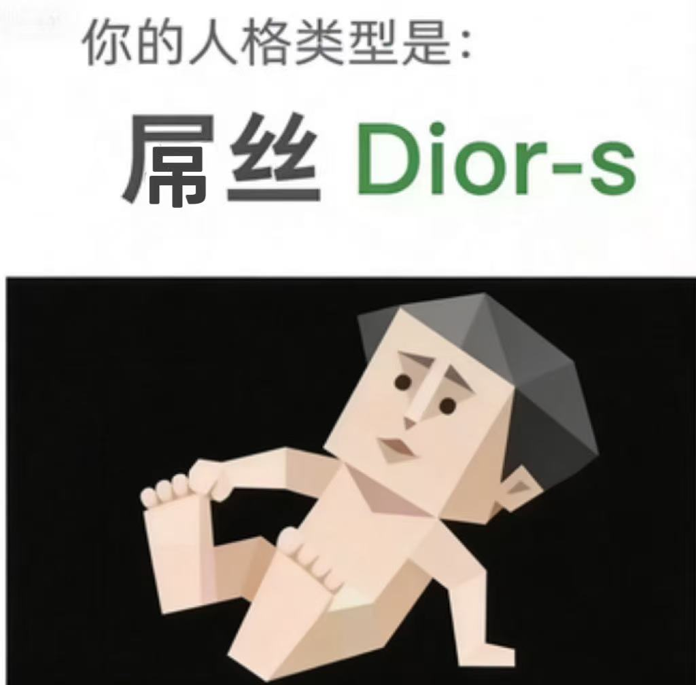
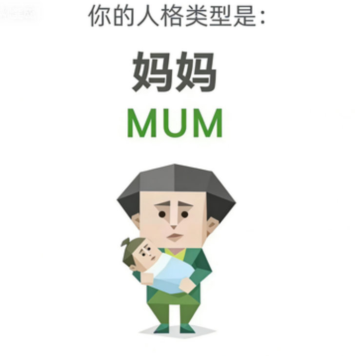
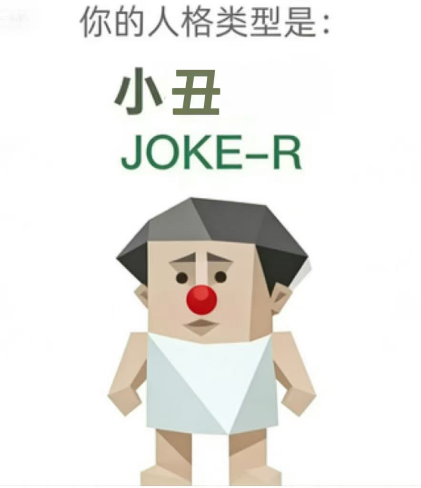
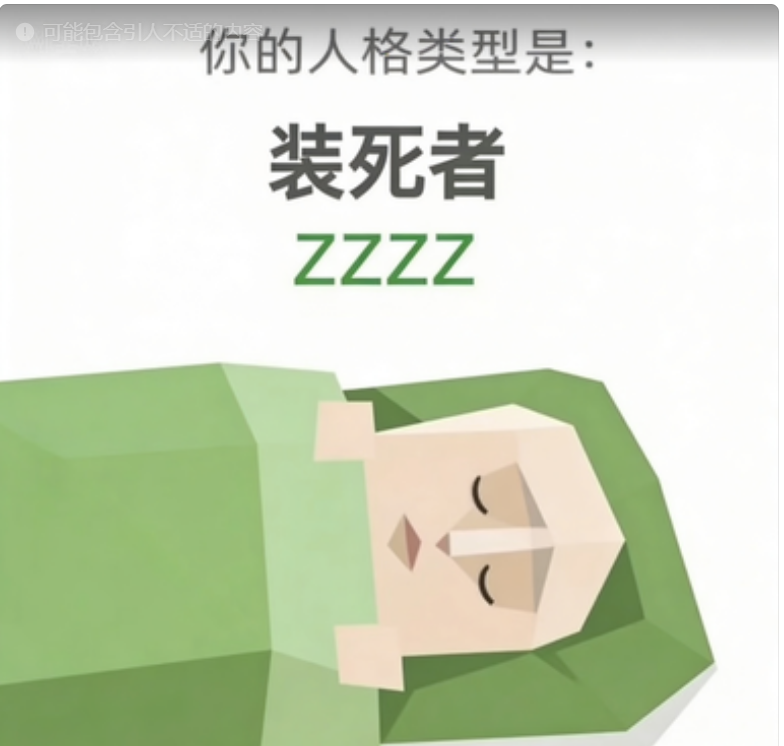
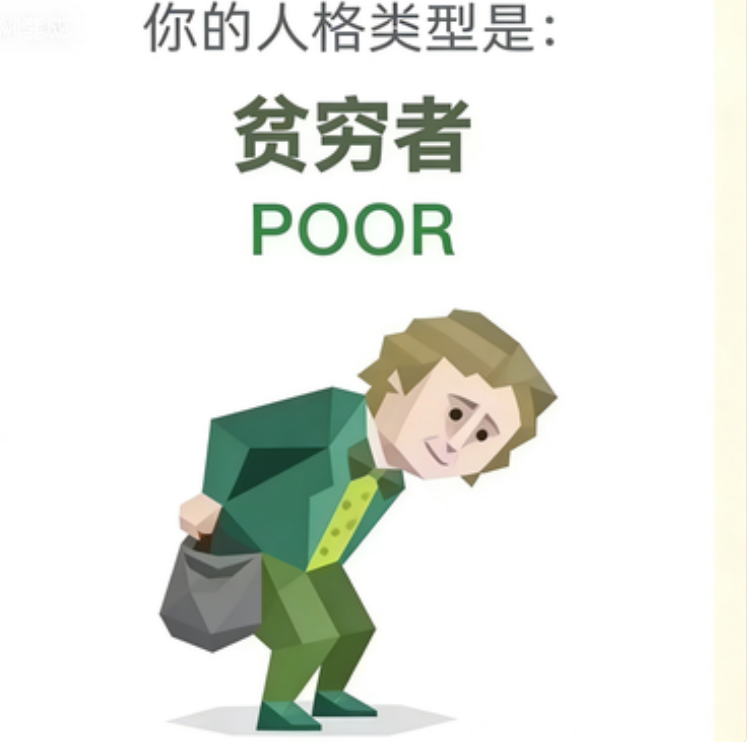
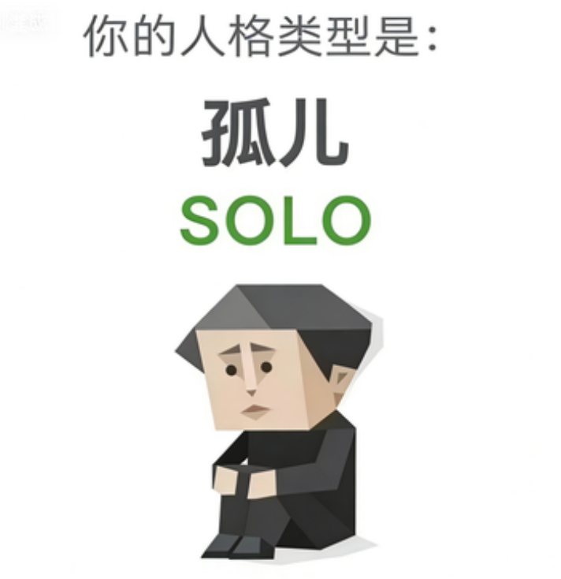
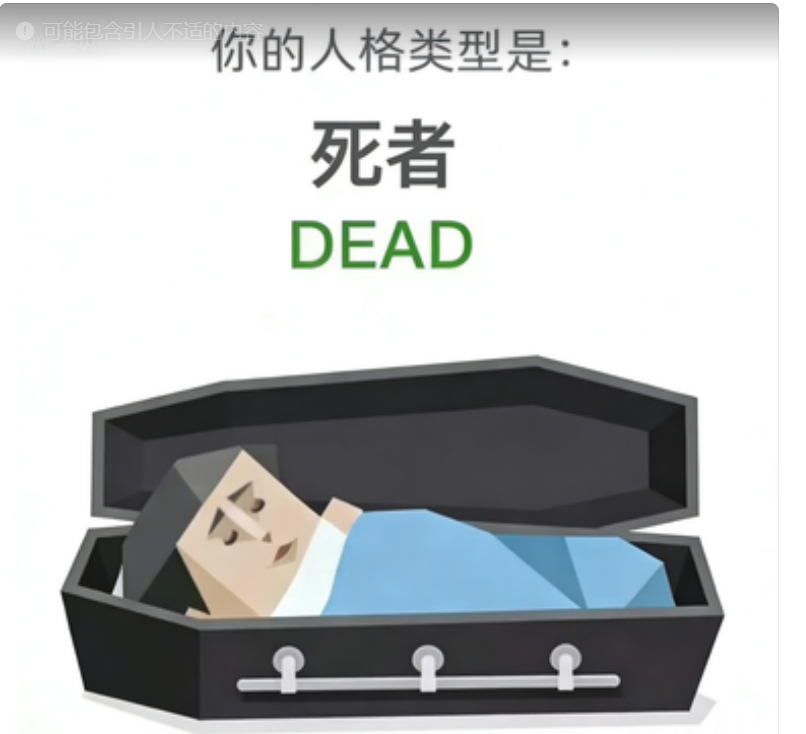

<h1 align="center">SBTI 人格测试 · 完整结果图鉴</h1>

  <em>MBTI 已经过时，SBTI 来了。</em> 
  一份把 <strong>27 种结局</strong>全部整理完的非官方中文 Wiki。

  
  &nbsp;
  

  <a href="https://sbti-wiki.vercel.app"><strong>👉 手机浏览推荐使用网页版 👈</strong></a> 
  支持深色模式、弹窗详情、一键分享、深链接

<blockquote align="center">
<strong>🇨🇳 中国大陆用户访问指南</strong> 
Vercel 在国内通常被 QoS 降速。推荐按顺序尝试： 
1️⃣ <strong><a href="https://sbti-wiki.pages.dev">Cloudflare Pages 镜像</a></strong>（与原测试站点 sbti.fancc.de5.net 同一套基础设施，部分地区能直连） 
2️⃣ 直接浏览 <strong><a href="outcomes/">GitHub 仓库里的 Markdown</a></strong>（GitHub 在国内时好时坏但基本能看） 
3️⃣ 通过 <a href="https://ghproxy.com/">ghproxy</a> 等镜像站访问本 repo 
4️⃣ 使用 VPN / 代理访问 Vercel 版本
</blockquote>

  
  
  
  
  
  

  
  
  
  
  
  

---

## 📖 目录

- [这是什么](#-这是什么)
- [📱 在线网页版（手机推荐）](#-在线网页版手机推荐)
- [如何看懂你的结果](#-如何看懂你的结果)
- [十五维度一览](#-十五维度一览)
- [27 种结局图鉴](#-27-种结局图鉴)
  - [标准人格（25 种）](#标准人格25-种)
  - [特殊人格（2 种）](#特殊人格2-种)
- [数据来源与原理](#-数据来源与原理)
- [鸣谢](#-鸣谢)
- [License](#-license)

---

## 📱 在线网页版（手机推荐）

**👉 [sbti-wiki.vercel.app](https://sbti-wiki.vercel.app)**

为了方便手机浏览，本仓库的 [`web/`](web/) 目录包含一个独立的静态 HTML 版本，已部署到 Vercel：

- 🌓 **深色模式**：跟随系统设置，也可手动切换
- 📐 **移动优先**：网格布局自适应手机屏幕
- 🪟 **弹窗详情**：点击人格卡片弹出 modal，查看完整解读和十五维度表
- 🔗 **深链接**：每个人格有独立 URL hash（如 `#CTRL`），可直接分享
- 📤 **一键分享**：调用 Web Share API（手机）或复制链接（桌面）
- ⚡ **零构建**：纯 HTML + Tailwind CDN，单文件应用，秒开

技术栈：Tailwind CDN + vanilla JS，27 个人格数据从 [`web/data/outcomes.json`](web/data/outcomes.json) 动态渲染，和 Markdown wiki 使用同一份权威数据。

---

## 🎯 这是什么

本仓库是对 [**sbti.fancc.de5.net**](https://sbti.fancc.de5.net) 这个最近在国内互联网爆火的 SBTI 人格测试做的完整图鉴整理。每一页收录：

- 🎨 **官方形象插画**（从 `main.js` 内嵌的 base64 解码还原）
- 🏷️ **代号 + 中文名 + 开场台词**
- 📊 **十五维度 H / M / L 标准模板**（作者预设的"标准答案"）
- 💬 **一句话解读**（整理者的补充说明，帮你快速理解这个人格）
- 📜 **原站完整解读**（折叠展示，点击展开看作者原文）

所有文案数据都是通过 [Bingran You](https://github.com/bingran-you) 的 [sbti-cli](https://github.com/bingran-you/sbti-cli) 从官网 `main.js` 的 sandbox runtime 里直接导出的，**字节级对齐**。

---

## 🧭 如何看懂你的结果

测试结束后系统做 3 件事：

| 步骤 | 做什么 |
|---|---|
| **1️⃣ 打分** | 把 30 道题的答案汇总到 **15 个维度**，每个维度打出 L（低）/ M（中）/ H（高）三档 |
| **2️⃣ 匹配** | 拿你的 15 维向量去和 25 个"标准人格"模板比对，**曼哈顿距离**最近的那个就是你的主类型。公式：`相似度 = 1 − 距离 / 30` |
| **3️⃣ 特殊分支** | 两种情况会跳过正常匹配： ① 最高匹配度 **< 60%** → 强制兜底 `HHHH`（傻乐者） ② 饮酒题 `drink_gate_q2` 选"保温杯白酒" → 隐藏结局 `DRUNK`（酒鬼） |

> 💡 **冷知识**：不喝酒的人实际只做 30 题；选了"喝酒"的会解锁第 31 题（隐藏的饮酒态度题）。

---

## 🧬 十五维度一览

测试把人拆成 **5 组模型 × 3 维度 = 15 维**：

<table>
<tr>
  <th>模型</th>
  <th colspan="3">维度</th>
</tr>
<tr>
  <td rowspan="1"><strong>🪞 自我模型</strong></td>
  <td>S1 自尊自信</td>
  <td>S2 自我清晰度</td>
  <td>S3 核心价值</td>
</tr>
<tr>
  <td><strong>❤️ 情感模型</strong></td>
  <td>E1 依恋安全感</td>
  <td>E2 情感投入度</td>
  <td>E3 边界与依赖</td>
</tr>
<tr>
  <td><strong>🌍 态度模型</strong></td>
  <td>A1 世界观倾向</td>
  <td>A2 规则与灵活度</td>
  <td>A3 人生意义感</td>
</tr>
<tr>
  <td><strong>⚡ 行动驱力</strong></td>
  <td>Ac1 动机导向</td>
  <td>Ac2 决策风格</td>
  <td>Ac3 执行模式</td>
</tr>
<tr>
  <td><strong>💬 社交模型</strong></td>
  <td>So1 社交主动性</td>
  <td>So2 人际边界感</td>
  <td>So3 表达与真实度</td>
</tr>
</table>

每个维度由 **2 道题** 打分，原始分范围 2–6；**≤ 3 → L**，**= 4 → M**，**≥ 5 → H**。具体每一档的含义见每个人格的详情页。

---

## 📊 理论稀有度排行榜

> **⚠️ 不是真实用户数据！** 官网没有公开任何统计，这份排行榜是在 3^15 ≈ 1434 万种均匀分布的 H/M/L 向量里 **随机采样 10 万次**，用 [sbti-cli](https://github.com/bingran-you/sbti-cli) 的匹配算法跑出来的**理论分布**。DRUNK 是按隐藏结局语义保守估计的 0.8%，其他人格按比例缩放。

> **有趣发现**：由于 15 维度的 H/M/L 分档几乎均匀（每档 1/3），作者预设的模板里 **BOSS 是最难抽中的标准人格**（全 H 在随机分布里概率很低），而 **OJBK**（全 M）最容易命中。而 HHHH 兜底其实只有 0.06% 的人会触发——因为随机向量很少能和 25 个模板都差距 > 40%。

### 🏆 最稀有 TOP 5

| 排名 | 代号 | 中文名 | 理论占比 | 约每 N 人 1 个 |
|:---:|---|---|:---:|:---:|
| 🥇 1 | **HHHH** | 傻乐者 | **0.06%** | 1 / 1667 |
| 🥇 2 | **DRUNK** | 酒鬼 | **0.8%** | 1 / 125 |
| 🥇 3 | **BOSS** | 领导者 | **1.53%** | 1 / 65 |
| 🥇 4 | **POOR** | 贫困者 | **1.68%** | 1 / 60 |
| 🥇 5 | **WOC!** | 握草人 | **2.04%** | 1 / 49 |

### 📈 最常见 TOP 5

| 排名 | 代号 | 中文名 | 理论占比 | 约每 N 人 1 个 |
|:---:|---|---|:---:|:---:|
| 🔝 1 | **OJBK** | 无所谓人 | **9.92%** | 1 / 10 |
| 🔝 2 | **THAN-K** | 感恩者 | **7.76%** | 1 / 13 |
| 🔝 3 | **FAKE** | 伪人 | **6.61%** | 1 / 15 |
| 🔝 4 | **SEXY** | 尤物 | **5.94%** | 1 / 17 |
| 🔝 5 | **MALO** | 吗喽 | **5.71%** | 1 / 18 |

📜 完整 27 种结局稀有度排行（点击展开）

| 排名 | 代号 | 中文名 | 理论占比 | 1/N | 分类 |
|:---:|---|---|:---:|:---:|:---:|
| 1 | OJBK | 无所谓人 | 9.92% | 1/10 | 较常见 |
| 2 | THAN-K | 感恩者 | 7.76% | 1/13 | 较常见 |
| 3 | FAKE | 伪人 | 6.61% | 1/15 | 较常见 |
| 4 | SEXY | 尤物 | 5.94% | 1/17 | 较常见 |
| 5 | MALO | 吗喽 | 5.71% | 1/18 | 较常见 |
| 6 | Dior-s | 屌丝 | 5.23% | 1/19 | 较常见 |
| 7 | MUM | 妈妈 | 5.14% | 1/19 | 较常见 |
| 8 | ZZZZ | 装死者 | 4.68% | 1/21 | 中等 |
| 9 | LOVE-R | 多情者 | 4.23% | 1/24 | 中等 |
| 10 | IMSB | 傻者 | 4.21% | 1/24 | 中等 |
| 11 | SOLO | 孤儿 | 3.72% | 1/27 | 中等 |
| 12 | CTRL | 拿捏者 | 3.61% | 1/28 | 中等 |
| 13 | FUCK | 草者 | 3.38% | 1/30 | 中等 |
| 14 | OH-NO | 哦不人 | 3.05% | 1/33 | 中等 |
| 15 | GOGO | 行者 | 3.05% | 1/33 | 中等 |
| 16 | JOKE-R | 小丑 | 2.99% | 1/33 | 中等 |
| 17 | MONK | 僧人 | 2.8% | 1/36 | 中等 |
| 18 | SHIT | 愤世者 | 2.53% | 1/40 | 中等 |
| 19 | DEAD | 死者 | 2.5% | 1/40 | 中等 |
| 20 | ATM-er | 送钱者 | 2.46% | 1/41 | 中等 |
| 21 | THIN-K | 思考者 | 2.24% | 1/45 | 中等 |
| 22 | IMFW | 废物 | 2.12% | 1/47 | 中等 |
| 23 | WOC! | 握草人 | 2.04% | 1/49 | 中等 |
| 24 | POOR | 贫困者 | 1.68% | 1/60 | 稀有 |
| 25 | BOSS | 领导者 | 1.53% | 1/65 | 稀有 |
| 26 | DRUNK | 酒鬼 | 0.8% | 1/125 | 极稀有 |
| 27 | HHHH | 傻乐者 | 0.06% | 1/1667 | 极稀有 |

---

## 🎭 27 种结局图鉴

### 标准人格（25 种）

<table>
  <tr>
    <td align="center" width="33%">
      <a href="outcomes/CTRL.md"> <strong>CTRL · 拿捏者</strong></a> 
      人形自走任务管理器 🎲 3.61% · 1/28
    </td>
    <td align="center" width="33%">
      <a href="outcomes/ATM-er.md"> <strong>ATM-er · 送钱者</strong></a> 
      永远在支付时间、精力、耐心 🎲 2.46% · 1/41
    </td>
    <td align="center" width="33%">
      <a href="outcomes/Dior-s.md"> <strong>Dior-s · 屌丝</strong></a> 
      第欧根尼的精神传人 🎲 5.23% · 1/19
    </td>
  </tr>
  <tr>
    <td align="center">
      <a href="outcomes/BOSS.md"> <strong>BOSS · 领导者</strong></a> 
      手里永远拿着方向盘的人 🎲 1.53% · 1/65
    </td>
    <td align="center">
      <a href="outcomes/THAN-K.md"> <strong>THAN-K · 感恩者</strong></a> 
      永不枯竭的正能量发射塔 🎲 7.76% · 1/13
    </td>
    <td align="center">
      <a href="outcomes/OH-NO.md"> <strong>OH-NO · 哦不人</strong></a> 
      一声"Oh no!"把风险扼杀在萌芽 🎲 3.05% · 1/33
    </td>
  </tr>
  <tr>
    <td align="center">
      <a href="outcomes/GOGO.md"> <strong>GOGO · 行者</strong></a> 
      世界只有已完成和即将被完成 🎲 3.05% · 1/33
    </td>
    <td align="center">
      <a href="outcomes/SEXY.md"> <strong>SEXY · 尤物</strong></a> 
      走进房间照明系统自动识别 🎲 5.94% · 1/17
    </td>
    <td align="center">
      <a href="outcomes/LOVE-R.md"> <strong>LOVE-R · 多情者</strong></a> 
      情感处理器是彩虹制的吟游诗人 🎲 4.23% · 1/24
    </td>
  </tr>
  <tr>
    <td align="center">
      <a href="outcomes/MUM.md"> <strong>MUM · 妈妈</strong></a> 
      给自己的药剂量总是小一号 🎲 5.14% · 1/19
    </td>
    <td align="center">
      <a href="outcomes/FAKE.md"> <strong>FAKE · 伪人</strong></a> 
      切面具比切输入法还快 🎲 6.61% · 1/15
    </td>
    <td align="center">
      <a href="outcomes/OJBK.md"> <strong>OJBK · 无所谓人</strong></a> 
      "都行"是一种统治哲学 🎲 9.92% · 1/10
    </td>
  </tr>
  <tr>
    <td align="center">
      <a href="outcomes/MALO.md"> <strong>MALO · 吗喽</strong></a> 
      灵魂还挂在树上荡秋千 🎲 5.71% · 1/18
    </td>
    <td align="center">
      <a href="outcomes/JOKE-R.md"> <strong>JOKE-R · 小丑</strong></a> 
      一层层打开最里面只剩回声 🎲 2.99% · 1/33
    </td>
    <td align="center">
      <a href="outcomes/WOC.md"> <strong>WOC! · 握草人</strong></a> 
      表面"卧槽"后台冷静分析 🎲 2.04% · 1/49
    </td>
  </tr>
  <tr>
    <td align="center">
      <a href="outcomes/THIN-K.md"> <strong>THIN-K · 思考者</strong></a> 
      审判一切信息的偏执党 🎲 2.24% · 1/45
    </td>
    <td align="center">
      <a href="outcomes/SHIT.md"> <strong>SHIT · 愤世者</strong></a> 
      嘴上骂世界手上拯救世界 🎲 2.53% · 1/40
    </td>
    <td align="center">
      <a href="outcomes/ZZZZ.md"> <strong>ZZZZ · 装死者</strong></a> 
      死线一到 29 分钟交答卷 🎲 4.68% · 1/21
    </td>
  </tr>
  <tr>
    <td align="center">
      <a href="outcomes/POOR.md"> <strong>POOR · 贫困者</strong></a> 
      精力全灌一个坑的矿井 🎲 1.68% · 1/60
    </td>
    <td align="center">
      <a href="outcomes/MONK.md"> <strong>MONK · 僧人</strong></a> 
      结界神圣不可侵犯的修行者 🎲 2.8% · 1/36
    </td>
    <td align="center">
      <a href="outcomes/IMSB.md"> <strong>IMSB · 傻者</strong></a> 
      内心戏比漫威宇宙还长 🎲 4.21% · 1/24
    </td>
  </tr>
  <tr>
    <td align="center">
      <a href="outcomes/SOLO.md"> <strong>SOLO · 孤儿</strong></a> 
      全身都是刺的软心脏刺猬 🎲 3.72% · 1/27
    </td>
    <td align="center">
      <a href="outcomes/FUCK.md"> <strong>FUCK · 草者</strong></a> 
      除草剂杀不死的人形野草 🎲 3.38% · 1/30
    </td>
    <td align="center">
      <a href="outcomes/DEAD.md"> <strong>DEAD · 死者</strong></a> 
      通关后删档 999 次的贤者 🎲 2.5% · 1/40
    </td>
  </tr>
  <tr>
    <td align="center">
      <a href="outcomes/IMFW.md"> <strong>IMFW · 废物</strong></a> 
      需要温室养护的兰花 🎲 2.12% · 1/47
    </td>
    <td align="center" colspan="2">
      <em>⬇️ 下方是 2 个特殊人格</em>
    </td>
  </tr>
</table>

### 特殊人格（2 种）

<table>
  <tr>
    <td align="center" width="50%">
      <a href="outcomes/HHHH.md"> <strong>HHHH · 傻乐者</strong></a> 
      🎲 <em>触发条件</em>：最高匹配度 &lt; 60% 的系统强制兜底 
      📊 理论占比 <strong>0.06%</strong> · 约 1/1667（全榜最稀有）
    </td>
    <td align="center" width="50%">
      <a href="outcomes/DRUNK.md"> <strong>DRUNK · 酒鬼</strong></a> 
      🍶 <em>触发条件</em>：饮酒题选"保温杯装白酒当白开水喝" 
      📊 估算占比 <strong>0.8%</strong> · 约 1/125（隐藏结局）
    </td>
  </tr>
</table>

---

## 🔬 数据来源与原理

### 为什么能做到字节级一致

官网的测试逻辑全部打包在 [`main.js`](https://sbti.fancc.de5.net/main.js) 里，内部用 4 个 JavaScript 常量承载全部结局数据：

| 常量名 | 内容 |
|---|---|
| `TYPE_LIBRARY` | 27 个人格的 `code` / `cn` / `intro` / `desc`（完整文案） |
| `NORMAL_TYPES` | 25 个标准人格的 H/M/L 模板字符串（如 `CTRL: "HHH-HMH-MHH-HHH-MHM"`） |
| `DIM_EXPLANATIONS` | 15 维 × 3 档 = 45 条分档解读 |
| `dimensionMeta` | 每个维度的中文名和所属模型分组 |

Bingran You 写的 [**sbti-cli**](https://github.com/bingran-you/sbti-cli) 用 Node.js 的 `vm` 模块把 `main.js` 在一个 sandbox 里跑起来（伪造一套 `document` / `window` stub），然后把这 4 个内部常量挂到 `globalThis.__sbtiExports` 上导出。

本 Wiki 的生成脚本直接调用 `loadSbtiRuntime()`，拿到这些对象，然后遍历生成 27 个 Markdown 文件。**所以所有文案的标点、空格、引号（包括 U+201C/U+201D 这种 Unicode curly quotes）都和线上完全一致**。

### 形象插画从哪里来

`main.js` 里还内嵌了一个全局 `TYPE_IMAGES` 对象，27 个角色插画以 `data:image/png;base64,...` 或 `data:image/jpeg;base64,...` 的形式编码在里面（共 27 项，4.6 MB）。本仓库的生成脚本把它们解码成独立文件放进 [`images/`](images/) 目录，这样 Markdown 里可以直接 `` 引用。

### 完整数据表

- [`data/dimensions.json`](data/dimensions.json) — 15 维度 meta + L/M/H 分档解读
- [`data/patterns.json`](data/patterns.json) — 25 个标准人格的 H/M/L 模板
- [`images/manifest.json`](images/manifest.json) — 27 张插画的文件清单

---

## 🙏 鸣谢

<table>
  <tr>
    <th>项目</th>
    <th>作者</th>
    <th>贡献</th>
  </tr>
  <tr>
    <td><a href="https://sbti.fancc.de5.net"><strong>SBTI 人格测试</strong></a></td>
    <td>B 站 <a href="https://space.bilibili.com/417038183">@蛆肉儿串儿</a></td>
    <td>原测试的作者，27 个人格文案 + 形象插画的版权持有者。测试首发是为了劝一位爱喝酒的朋友戒酒</td>
  </tr>
  <tr>
    <td><a href="https://github.com/bingran-you/sbti-cli"><strong>sbti-cli</strong></a></td>
    <td><a href="https://github.com/bingran-you">Bingran You (@bingran-you)</a></td>
    <td>把官网 <code>main.js</code> sandbox 化，暴露出 <code>TYPE_LIBRARY</code> 等内部常量，让这份 Wiki 能直接从 runtime 抓取权威数据与插画</td>
  </tr>
  <tr>
    <td><strong>本 Wiki</strong></td>
    <td><a href="https://github.com/serenakeyitan">@serenakeyitan</a></td>
    <td>把 sbti-cli 导出的数据整理成 27 页中文 Markdown 图鉴</td>
  </tr>
</table>

> ⚠️ **仅供娱乐**：作者本人已经在测试首页写清楚了——"别拿它当诊断、面试、相亲、分手、招魂、算命或人生判决书"。这个仓库也只是整理一份方便检索的图鉴，不提供任何心理学意义上的诊断价值。

---

## 📄 License

内容整理遵循 **CC BY-NC-SA 4.0**，所有文案和插画的版权归原作者所有，**禁止用于任何商业盈利用途**。
