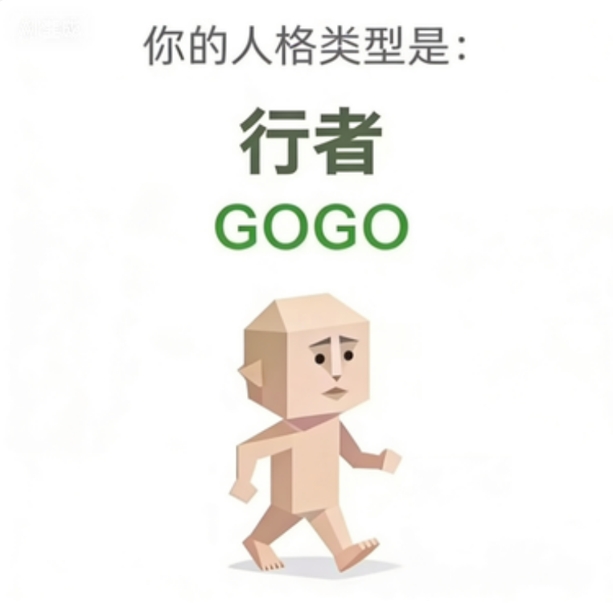

# GOGO · 行者

> *gogogo~出发咯*

  

**类别：标准人格**　·　**十五维度模板：`HHM-HMH-MMH-HHH-MHM`**

## 一句话解读

和 CTRL 非常接近，但 S3 核心价值是 M 而不是 H，So1 主动性也略低。差别在于：CTRL 在拿捏别人，GOGO 在拿捏自己的 todo list，目标更"所见即所得"。

## 十五维度模板

下表是这个人格在 15 个维度上的 **"标准答案"**。做测试时你的 15 维 H/M/L 向量越接近这张表，匹配度就越高。

| 模型 | 维度 | 等级 | 解读 |
|---|---|---|---|
| 自我模型 | S1 自尊自信 | **H（高）** | 心里对自己大致有数，不太会被路人一句话打散。 |
| 自我模型 | S2 自我清晰度 | **H（高）** | 对自己的脾气、欲望和底线都算门儿清。 |
| 自我模型 | S3 核心价值 | **M（中）** | 想上进，也想躺会儿，价值排序经常内部开会。 |
| 情感模型 | E1 依恋安全感 | **H（高）** | 更愿意相信关系本身，不会被一点风吹草动吓散。 |
| 情感模型 | E2 情感投入度 | **M（中）** | 会投入，但会给自己留后手，不至于全盘梭哈。 |
| 情感模型 | E3 边界与依赖 | **H（高）** | 空间感很重要，再爱也得留一块属于自己的地。 |
| 态度模型 | A1 世界观倾向 | **M（中）** | 既不天真也不彻底阴谋论，观望是你的本能。 |
| 态度模型 | A2 规则与灵活度 | **M（中）** | 该守的时候守，该变通的时候也不死磕。 |
| 态度模型 | A3 人生意义感 | **H（高）** | 做事更有方向，知道自己大概要往哪边走。 |
| 行动驱力模型 | Ac1 动机导向 | **H（高）** | 更容易被成果、成长和推进感点燃。 |
| 行动驱力模型 | Ac2 决策风格 | **H（高）** | 拍板速度快，决定一下就不爱回头磨叽。 |
| 行动驱力模型 | Ac3 执行模式 | **H（高）** | 推进欲比较强，事情不落地心里都像卡了根刺。 |
| 社交模型 | So1 社交主动性 | **M（中）** | 有人来就接，没人来也不硬凑，社交弹性一般。 |
| 社交模型 | So2 人际边界感 | **H（高）** | 边界感偏强，靠太近会先本能性后退半步。 |
| 社交模型 | So3 表达与真实度 | **M（中）** | 会看气氛说话，真实和体面通常各留一点。 |

## 原站完整解读

点击展开原文（来自 <a href="https://sbti.fancc.de5.net">sbti.fancc.de5.net</a>）

经研究发现，GOGO人格的大脑构造与常人有根本性不同。GOGO活在一个极致的“所见即所得”世界里，人生信条简单粗暴到令人发指：只要我闭上眼睛，天就是黑的；只要我把钱都花了，我就没有钱了；只要我站在斑马线上，我现在就是行人了。逻辑完美闭环，根本无法反驳。别人还在为“先有鸡还是先有蛋”而辩论，GOGO行者已经把鸡和蛋一起做成了一盘“鸡生蛋，蛋生鸡之终极奥义盖浇饭”。他们不是在“解决问题”，他们是在“清除待办事项”。对他们来说，世界上只有两种状态：已完成，和即将被我完成。

---

[← 返回结果总览](../README.md)
